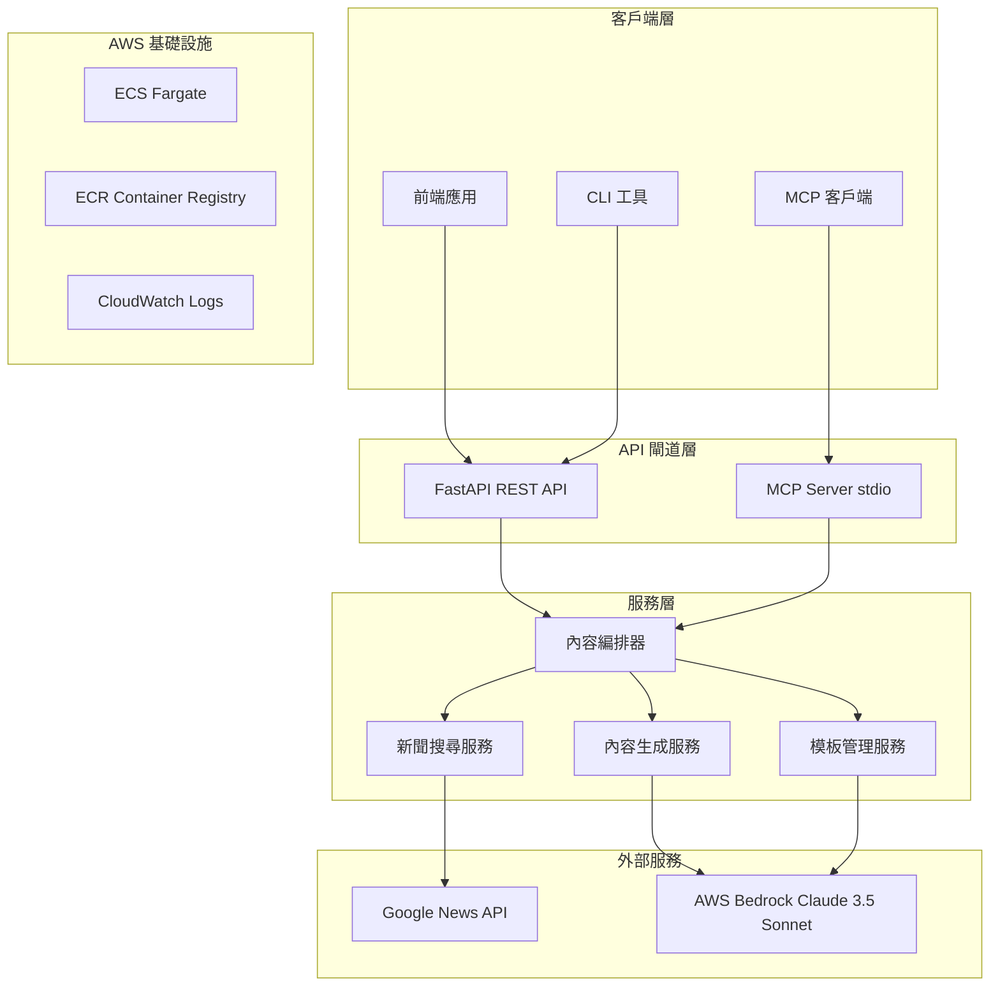
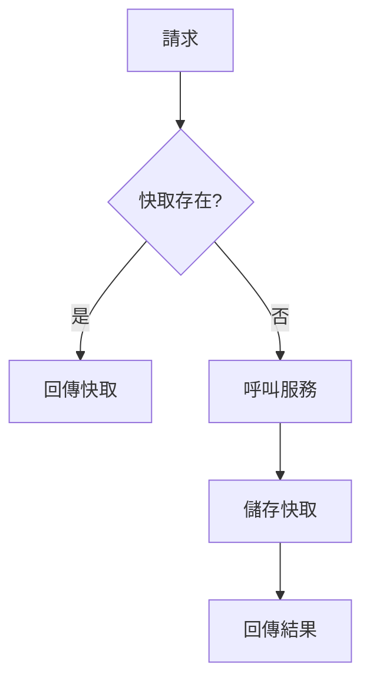
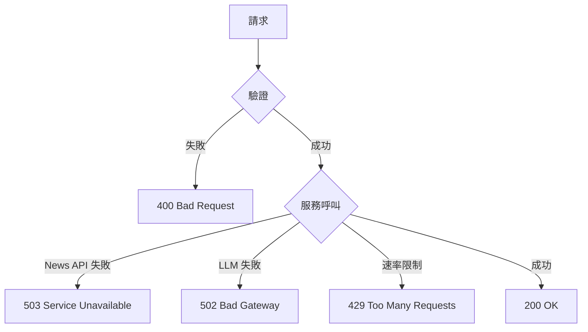
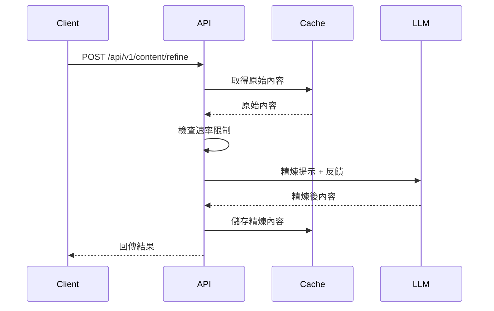
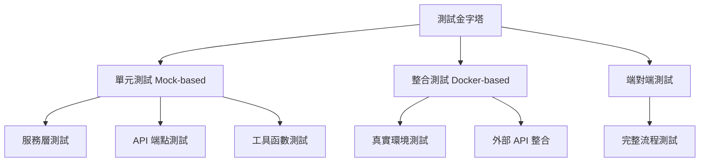
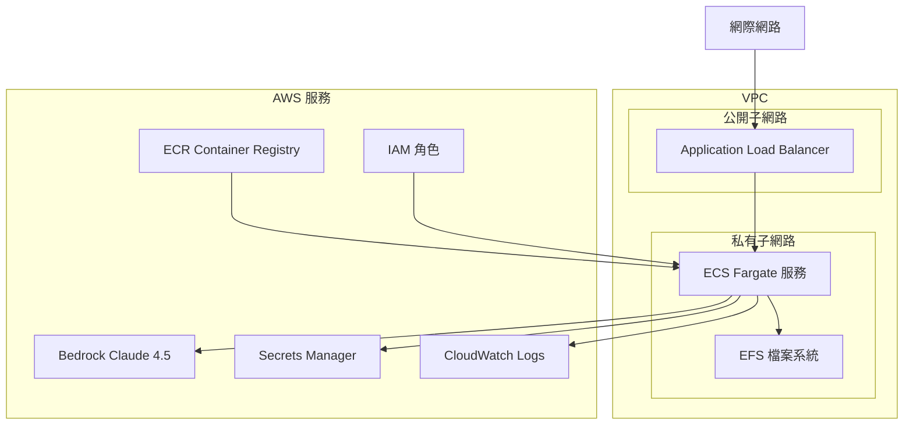
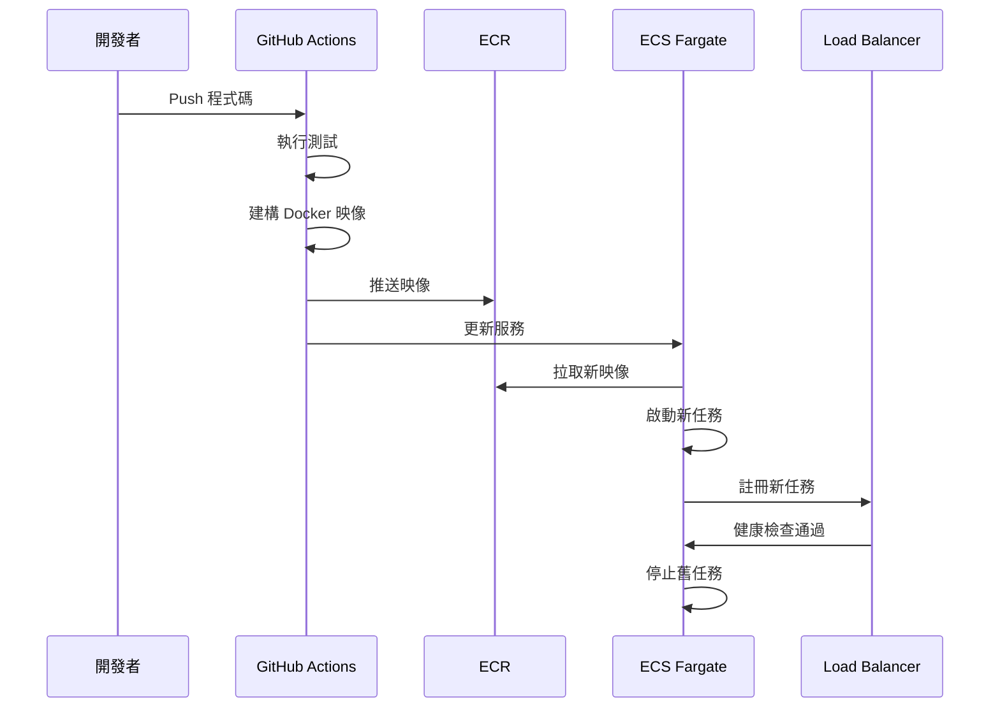
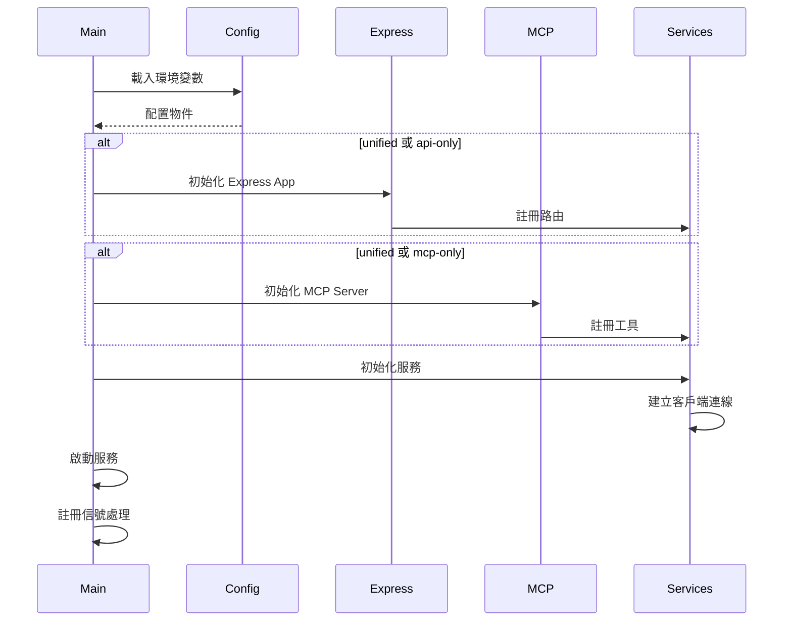

# 設計文件

## 概述

司法正義論述生成器後端服務是一個本地執行的 Python FastAPI 應用，提供 RESTful API 和 MCP (Model Context Protocol) 介面。服務整合新聞搜尋 API 和大型語言模型（LLM），協助使用者針對受害者權益、反廢死和司法不公等議題，生成適合不同社群平台的論述內容。

### 核心功能

- 新聞搜尋與內容聚合
- AI 驅動的論述內容生成
- 多平台格式優化（Instagram、Facebook、LINE）
- 內容精煉與迭代改進
- RESTful API 和 MCP 雙介面支援

### 技術棧

- **後端框架**: Express.js (Node.js 20+)
- **API 文件**: OpenAPI 3.0 (Swagger)
- **LLM 整合**: AWS Bedrock Claude Sonnet 4.5
- **新聞 API**: Google News API 或類似服務
- **MCP 支援**: @modelcontextprotocol/sdk (stdio transport)
- **部署**: AWS ECS Fargate (Docker 容器化)
- **測試**: Jest, Supertest (單元測試和整合測試)
- **AWS 服務**: Bedrock, ECS, Fargate, ECR, CloudWatch, IAM
- **TypeScript**: 完整型別安全

## 架構

### 系統架構圖



````

### 架構設計決策

**決策 1: 統一服務架構（Unified Service Mode）**
- **理由**: 遵循專案的統一服務架構模式，支援 unified、api-only、mcp-only 三種模式
- **優點**: 程式碼重用、一致的業務邏輯、簡化部署
- **實作**: 使用 `SERVICE_MODE` 環境變數控制啟動模式

**決策 1.1: AWS ECS Fargate 部署**
- **理由**: 無伺服器容器運算，自動擴展，無需管理基礎設施
- **優點**: 按需付費、自動擴展、高可用性、與 AWS 服務深度整合
- **實作**: Docker 容器打包，透過 ECR 部署到 Fargate

**決策 2: Express.js + TypeScript 作為主要框架**
- **理由**:
  - Node.js 生態系統成熟，套件豐富
  - 原生 async/await 支援
  - TypeScript 提供完整型別安全
  - 與 MCP SDK 完美整合（原生 Node.js 支援）
  - 輕量級且靈活
- **優點**: 開發效率高、社群支援強大、易於維護
- **實作**: 使用 Express.js 路由、中介軟體和依賴注入模式

**決策 3: 統一業務邏輯層**
- **理由**: Express API 和 MCP Server 共享相同的業務邏輯層
- **優點**: 零程式碼重複、一致的行為、易於維護
- **實作**:
  - 業務邏輯封裝在 Service 層
  - Express 路由和 MCP 工具都呼叫相同的 Service
  - 使用依賴注入模式管理服務實例

**決策 4: 分層架構設計**
- **理由**: 關注點分離、可測試性、可維護性
- **優點**: 清晰的職責劃分、易於擴展、支援 TDD
- **層級**: API 層 → 編排層 → 服務層 → 外部整合層

## 元件與介面

### 核心元件

#### 1. API 閘道層

**Express.js REST API**
- 職責: 處理 HTTP 請求、驗證、路由
- 端點: `/api/v1/*`
- 中介軟體: 認證、錯誤處理、日誌記錄、CORS
- OpenAPI 文件: 使用 swagger-jsdoc 和 swagger-ui-express

**MCP Server (stdio)**
- 職責: 處理 MCP 協議通訊
- 傳輸: stdio (標準輸入/輸出)
- SDK: @modelcontextprotocol/sdk
- 工具: search_news, generate_content, refine_content

#### 2. 服務層

**NewsSearchService**
```typescript
export class NewsSearchService {
  constructor(private newsApiClient: NewsAPIClient) {}

  async searchNews(
    keywords: string[],
    maxResults: number = 20
  ): Promise<NewsArticle[]> {
    // 搜尋新聞並回傳結果
  }
}
```

**ContentGenerationService**
```typescript
export class ContentGenerationService {
  constructor(
    private bedrockClient: BedrockClient,
    private templateService: TemplateManagementService
  ) {}

  async generateContent(
    userInput: string,
    topicTemplates: string[],
    platformType: PlatformType,
    newsContext: NewsArticle[]
  ): Promise<ContentVariant[]> {
    // 生成多個內容變體
  }

  async refineContent(
    contentId: string,
    feedback: string
  ): Promise<ContentVariant> {
    // 根據反饋精煉內容
  }
}
```

**TemplateManagementService**
```typescript
export class TemplateManagementService {
  getTemplates(lang: string = 'zh_TW'): TopicTemplate[] {
    // 取得所有主題模板
  }

  getTemplateById(templateId: string): TopicTemplate {
    // 根據 ID 取得特定模板
  }
}
```

**ContentOrchestrator**
```typescript
export class ContentOrchestrator {
  constructor(
    private newsService: NewsSearchService,
    private contentService: ContentGenerationService,
    private templateService: TemplateManagementService
  ) {}

  async orchestrateContentGeneration(
    request: ContentGenerationRequest
  ): Promise<ContentGenerationResponse> {
    // 編排完整的內容生成流程
  }
}
```

#### 3. 外部整合層

**NewsAPIClient**
```typescript
export class NewsAPIClient {
  constructor(private apiKey: string) {}

  async search(
    query: string,
    maxResults: number = 20
  ): Promise<Record<string, any>[]> {
    // 呼叫新聞 API 搜尋
  }
}
```

**BedrockClient**
```typescript
import { BedrockRuntimeClient, InvokeModelCommand } from '@aws-sdk/client-bedrock-runtime';

export class BedrockClient {
  private client: BedrockRuntimeClient;
  private modelId = 'anthropic.claude-sonnet-4-5-20250929-v1:0';

  constructor(region: string = 'us-east-1') {
    this.client = new BedrockRuntimeClient({
      region,
      requestHandler: {
        requestTimeout: 3600000 // 60 分鐘
      }
    });
  }

  async generateCompletion(
    prompt: string,
    temperature: number = 0.7,
    maxTokens: number = 4096,
    systemPrompt?: string
  ): Promise<string> {
    // 生成 LLM 回應
  }

  private getModelId(): string {
    return this.modelId;
  }
}
```

### API 端點設計

#### RESTful API 端點

```mermaid
graph LR
    A[Client] -->|GET| B[/health]
    A -->|GET| C[/openapi.json]
    A -->|POST| D[/api/v1/news/search]
    A -->|POST| E[/api/v1/content/generate]
    A -->|POST| F[/api/v1/content/refine]
    A -->|GET| G[/api/v1/templates]
```

**端點規格**

1. `GET /health`

   - 回應: `{"status": "healthy", "version": "1.0.0"}`
   - 回應時間: < 50ms

2. `GET /openapi.json`

   - 回應: OpenAPI 3.0 規格文件
   - 回應時間: < 100ms

3. `POST /api/v1/news/search`

   - 請求: `{"keywords": ["關鍵字1", "關鍵字2"]}`
   - 回應: `{"results": [...], "total": 10}`
   - 回應時間: < 10s

4. `POST /api/v1/content/generate`

   - 請求: `{"user_input": "...", "topic_templates": [...], "platform_type": "instagram", "selected_news_urls": [...]}`
   - 回應: `{"variants": [...], "generation_id": "..."}`
   - 回應時間: < 30s

5. `POST /api/v1/content/refine`

   - 請求: `{"content_id": "...", "feedback": "..."}`
   - 回應: `{"refined_content": {...}}`
   - 回應時間: < 20s

6. `GET /api/v1/templates?lang=zh_TW`
   - 回應: `{"templates": [...]}`
   - 回應時間: < 500ms

#### MCP 工具設計

**工具列表**

1. `search_news` - 搜尋新聞
2. `generate_content` - 生成內容
3. `refine_content` - 精煉內容

**MCP Server 實作（使用 @modelcontextprotocol/sdk）**

```typescript
import { Server } from '@modelcontextprotocol/sdk/server/index.js';
import { StdioServerTransport } from '@modelcontextprotocol/sdk/server/stdio.js';
import {
  CallToolRequestSchema,
  ListToolsRequestSchema,
} from '@modelcontextprotocol/sdk/types.js';

export class MCPServer {
  private server: Server;
  private orchestrator: ContentOrchestrator;

  constructor(orchestrator: ContentOrchestrator) {
    this.orchestrator = orchestrator;
    this.server = new Server(
      {
        name: 'advocacy-content-generator',
        version: '1.0.0',
      },
      {
        capabilities: {
          tools: {},
        },
      }
    );

    this.setupHandlers();
  }

  private setupHandlers() {
    // 列出可用工具
    this.server.setRequestHandler(ListToolsRequestSchema, async () => ({
      tools: [
        {
          name: 'search_news',
          description: '搜尋新聞',
          inputSchema: {
            type: 'object',
            properties: {
              keywords: {
                type: 'array',
                items: { type: 'string' },
                description: '搜尋關鍵字'
              }
            },
            required: ['keywords']
          }
        },
        {
          name: 'generate_content',
          description: '生成論述內容',
          inputSchema: {
            type: 'object',
            properties: {
              user_input: { type: 'string' },
              topic_templates: { type: 'array', items: { type: 'string' } },
              platform_type: { type: 'string', enum: ['instagram', 'facebook', 'line'] },
              selected_news_urls: { type: 'array', items: { type: 'string' } }
            },
            required: ['user_input', 'topic_templates', 'platform_type']
          }
        },
        {
          name: 'refine_content',
          description: '精煉內容',
          inputSchema: {
            type: 'object',
            properties: {
              content_id: { type: 'string' },
              feedback: { type: 'string' }
            },
            required: ['content_id', 'feedback']
          }
        }
      ]
    }));

    // 處理工具呼叫
    this.server.setRequestHandler(CallToolRequestSchema, async (request) => {
      const { name, arguments: args } = request.params;

      switch (name) {
        case 'search_news':
          const newsResult = await this.orchestrator.newsService.searchNews(
            args.keywords as string[]
          );
          return {
            content: [{ type: 'text', text: JSON.stringify(newsResult) }]
          };

        case 'generate_content':
          const contentResult = await this.orchestrator.orchestrateContentGeneration(
            args as any
          );
          return {
            content: [{ type: 'text', text: JSON.stringify(contentResult) }]
          };

        case 'refine_content':
          const refinedResult = await this.orchestrator.contentService.refineContent(
            args.content_id as string,
            args.feedback as string
          );
          return {
            content: [{ type: 'text', text: JSON.stringify(refinedResult) }]
          };

        default:
          throw new Error(`Unknown tool: ${name}`);
      }
    });
  }

  async start() {
    const transport = new StdioServerTransport();
    await this.server.connect(transport);
  }
}
```

### 介面定義

#### 請求/回應模型

```typescript
// TypeScript 介面定義
export interface NewsSearchRequest {
  keywords: string[]; // 1-10 個關鍵字
}

export interface NewsArticle {
  title: string;
  source: string;
  published_date: Date;
  url: string;
  summary: string;
}

export interface NewsSearchResponse {
  results: NewsArticle[]; // 5-20 筆結果
  total: number;
}

export type PlatformType = 'instagram' | 'facebook' | 'line';

export interface ContentGenerationRequest {
  user_input: string;
  topic_templates: string[];
  platform_type: PlatformType;
  selected_news_urls: string[];
}

export interface ContentVariant {
  text: string;
  image_suggestion: string;
  hashtags: string[];
  metadata: Record<string, any>;
}

export interface ContentGenerationResponse {
  variants: ContentVariant[]; // 固定 3 個變體
  generation_id: string;
}

export interface ContentRefineRequest {
  content_id: string;
  feedback: string; // 至少 10 個字元
}

export interface TopicTemplate {
  template_id: string;
  name: string;
  description: string;
  tone_guidelines: string;
  example_output: string;
}
```

**OpenAPI Schema 定義（使用 Zod）**

```typescript
import { z } from 'zod';

export const NewsSearchRequestSchema = z.object({
  keywords: z.array(z.string()).min(1).max(10)
});

export const ContentGenerationRequestSchema = z.object({
  user_input: z.string(),
  topic_templates: z.array(z.string()),
  platform_type: z.enum(['instagram', 'facebook', 'line']),
  selected_news_urls: z.array(z.string().url())
});

export const ContentRefineRequestSchema = z.object({
  content_id: z.string(),
  feedback: z.string().min(10)
});
```

## 資料模型

### 資料庫設計

**設計決策: 無持久化資料庫**

- **理由**: 服務為無狀態設計，無需長期儲存資料
- **替代方案**: 使用記憶體快取和 EFS（Elastic File System）暫存
- **優點**: 簡化部署、降低複雜度、支援 Fargate 無狀態容器
- **未來擴展**: 可整合 DynamoDB 或 RDS 進行持久化儲存

### 快取策略



**快取層級**

1. **L1 快取**: 記憶體 LRU 快取（模板、配置）
2. **L2 快取**: EFS 檔案系統快取（生成內容、新聞結果）
3. **未來擴展**: ElastiCache Redis（分散式快取）

**快取實作**

```typescript
import fs from 'fs/promises';
import path from 'path';
import { LRUCache } from 'lru-cache';
import { TopicTemplate, ContentVariant } from '../types/domain';

export class CacheManager {
  private cacheDir: string;
  private templateCache: LRUCache<string, TopicTemplate>;

  constructor(cacheDir: string = '.cache') {
    this.cacheDir = cacheDir;
    // L1 快取: LRU 記憶體快取
    this.templateCache = new LRUCache<string, TopicTemplate>({
      max: 100,
      ttl: 1000 * 60 * 60 // 1 小時
    });
    this.ensureCacheDir();
  }

  private async ensureCacheDir(): Promise<void> {
    await fs.mkdir(this.cacheDir, { recursive: true });
  }

  getTemplate(templateId: string): TopicTemplate | undefined {
    // L1 快取: 模板
    return this.templateCache.get(templateId);
  }

  setTemplate(templateId: string, template: TopicTemplate): void {
    this.templateCache.set(templateId, template);
  }

  async getCachedContent(contentId: string): Promise<ContentVariant | null> {
    // L2 快取: 生成內容
    const cacheFile = path.join(this.cacheDir, `${contentId}.json`);
    try {
      const data = await fs.readFile(cacheFile, 'utf-8');
      return JSON.parse(data) as ContentVariant;
    } catch {
      return null;
    }
  }

  async setCachedContent(contentId: string, content: ContentVariant): Promise<void> {
    // 儲存內容到快取
    const cacheFile = path.join(this.cacheDir, `${contentId}.json`);
    await fs.writeFile(cacheFile, JSON.stringify(content, null, 2));
  }
}
```

### 速率限制追蹤

**設計決策: 記憶體速率限制器**

- **理由**: 初期部署為單一容器實例，使用記憶體追蹤
- **實作**: 使用 Map 追蹤請求計數
- **未來擴展**: 多實例部署時可整合 ElastiCache Redis 實現分散式速率限制

```typescript
export class RateLimiter {
  private refineCounts: Map<string, Date[]>;

  constructor() {
    this.refineCounts = new Map();
  }

  checkRefineLimit(contentId: string): boolean {
    // 檢查精煉次數限制（5次/小時）
    const now = new Date();
    const oneHourAgo = new Date(now.getTime() - 60 * 60 * 1000);

    // 取得該內容的歷史記錄
    const timestamps = this.refineCounts.get(contentId) || [];

    // 清理過期記錄
    const validTimestamps = timestamps.filter(ts => ts > oneHourAgo);

    // 檢查限制
    if (validTimestamps.length >= 5) {
      return false;
    }

    // 新增當前時間戳記
    validTimestamps.push(now);
    this.refineCounts.set(contentId, validTimestamps);

    return true;
  }

  // 清理過期的記錄（定期執行）
  cleanup(): void {
    const oneHourAgo = new Date(Date.now() - 60 * 60 * 1000);

    for (const [contentId, timestamps] of this.refineCounts.entries()) {
      const validTimestamps = timestamps.filter(ts => ts > oneHourAgo);

      if (validTimestamps.length === 0) {
        this.refineCounts.delete(contentId);
      } else {
        this.refineCounts.set(contentId, validTimestamps);
      }
    }
  }
}
```

## 錯誤處理

### 錯誤處理策略



### 自訂例外類別

```typescript
export class APIException extends Error {
  constructor(
    public statusCode: number,
    public detail: string,
    public requestId: string
  ) {
    super(detail);
    this.name = this.constructor.name;
    Error.captureStackTrace(this, this.constructor);
  }
}

export class ValidationError extends APIException {
  constructor(detail: string, requestId: string) {
    super(400, detail, requestId);
  }
}

export class NewsAPIUnavailable extends APIException {
  constructor(
    detail: string,
    requestId: string,
    public retryAfter: number = 60
  ) {
    super(503, detail, requestId);
  }
}

export class LLMProviderError extends APIException {
  constructor(detail: string, requestId: string) {
    super(502, detail, requestId);
  }
}

export class RateLimitExceeded extends APIException {
  constructor(detail: string, requestId: string) {
    super(429, detail, requestId);
  }
}
```

### 錯誤回應格式

```typescript
export interface ErrorResponse {
  error: string;
  detail: string;
  request_id: string;
  timestamp: string;
  retry_after?: number;
}

// 範例錯誤回應
{
  "error": "NewsAPIUnavailable",
  "detail": "Google News API is temporarily unavailable",
  "request_id": "req_abc123",
  "timestamp": "2025-11-12T10:30:00Z",
  "retry_after": 60
}
```

### 重試機制

**設計決策: 指數退避重試**

- **理由**: 避免對外部服務造成過大壓力
- **實作**: 最多重試 3 次，間隔 1s, 2s, 4s

```typescript
export async function retryWithBackoff<T>(
  func: () => Promise<T>,
  maxRetries: number = 3,
  baseDelay: number = 1000
): Promise<T> {
  for (let attempt = 0; attempt < maxRetries; attempt++) {
    try {
      return await func();
    } catch (error) {
      if (attempt === maxRetries - 1) {
        throw error;
      }
      const delay = baseDelay * Math.pow(2, attempt);
      await new Promise(resolve => setTimeout(resolve, delay));
    }
  }
  throw new Error('Retry failed');
}
```

## 提示工程與 LLM 整合

### LLM 配置

**設計決策: AWS Bedrock Claude Sonnet 4.5 作為主要 LLM**

- **理由**:
  - Claude Sonnet 4.5 是 Anthropic 最新且最強大的模型（2025 年 9 月發布）
  - 卓越的中文生成能力和推理能力
  - 支援更長的上下文窗口和輸出長度
  - AWS 原生整合，無需額外 API Key 管理
  - 支援 IAM 角色認證，安全性更高
  - 符合企業級合規要求
  - 支援文字和圖片輸入（多模態）
  - 支援串流回應
- **模型 ID**: `anthropic.claude-sonnet-4-5-20250929-v1:0`
- **支援區域**: us-east-1, us-east-2, us-west-1, us-west-2, ap-northeast-1, ap-southeast-2, eu-central-1, eu-west-1 等
- **配置**: 透過 AWS IAM 角色和環境變數 `AWS_REGION`

**LLM 參數設定**

```typescript
export const BEDROCK_CONFIG = {
  modelId: 'anthropic.claude-sonnet-4-5-20250929-v1:0',
  temperature: 0.7,  // 平衡創意與一致性
  maxTokens: 4096,   // Claude 4.5 支援更長的輸出
  topP: 0.9,
  topK: 250,
  anthropicVersion: 'bedrock-2023-05-31'
} as const;
```

**AWS Bedrock 客戶端實作**

```typescript
import {
  BedrockRuntimeClient,
  InvokeModelCommand,
  InvokeModelCommandInput,
  InvokeModelWithResponseStreamCommand,
  InvokeModelWithResponseStreamCommandInput
} from '@aws-sdk/client-bedrock-runtime';
import { BEDROCK_CONFIG } from '../config';

export class BedrockClient {
  private client: BedrockRuntimeClient;
  private modelId: string;

  constructor(region: string = 'us-east-1') {
    // 配置 AWS SDK 客戶端，增加超時時間
    // Claude 4.5 的超時時間為 60 分鐘
    this.client = new BedrockRuntimeClient({
      region,
      requestHandler: {
        requestTimeout: 3600000, // 60 分鐘
        connectionTimeout: 60000
      },
      maxAttempts: 3
    });
    this.modelId = BEDROCK_CONFIG.modelId;
  }

  async generateCompletion(
    prompt: string,
    temperature: number = 0.7,
    maxTokens: number = 4096,
    systemPrompt?: string
  ): Promise<string> {
    /**
     * 生成 LLM 回應
     *
     * @param prompt - 使用者提示
     * @param temperature - 溫度參數 (0.0-1.0)
     * @param maxTokens - 最大輸出 token 數
     * @param systemPrompt - 系統提示（可選）
     * @returns 生成的文字回應
     */

    // 構建 Claude Sonnet 4.5 請求格式（Messages API）
    const requestBody: any = {
      anthropic_version: BEDROCK_CONFIG.anthropicVersion,
      max_tokens: maxTokens,
      temperature,
      top_p: BEDROCK_CONFIG.topP,
      top_k: BEDROCK_CONFIG.topK,
      messages: [
        {
          role: 'user',
          content: [
            {
              type: 'text',
              text: prompt
            }
          ]
        }
      ]
    };

    // 如果提供系統提示，加入請求中
    if (systemPrompt) {
      requestBody.system = systemPrompt;
    }

    // 呼叫 Bedrock API
    const params: InvokeModelCommandInput = {
      modelId: this.modelId,
      contentType: 'application/json',
      accept: 'application/json',
      body: JSON.stringify(requestBody)
    };

    const command = new InvokeModelCommand(params);
    const response = await this.client.send(command);

    // 解析回應
    const jsonString = new TextDecoder().decode(response.body);
    const responseBody = JSON.parse(jsonString);

    return responseBody.content[0].text;
  }

  async *generateCompletionStream(
    prompt: string,
    temperature: number = 0.7,
    maxTokens: number = 4096,
    systemPrompt?: string
  ): AsyncGenerator<string> {
    /**
     * 生成 LLM 回應（串流模式）
     *
     * @param prompt - 使用者提示
     * @param temperature - 溫度參數
     * @param maxTokens - 最大輸出 token 數
     * @param systemPrompt - 系統提示（可選）
     * @yields 生成的文字片段
     */

    const requestBody: any = {
      anthropic_version: BEDROCK_CONFIG.anthropicVersion,
      max_tokens: maxTokens,
      temperature,
      top_p: BEDROCK_CONFIG.topP,
      top_k: BEDROCK_CONFIG.topK,
      messages: [
        {
          role: 'user',
          content: [
            {
              type: 'text',
              text: prompt
            }
          ]
        }
      ]
    };

    if (systemPrompt) {
      requestBody.system = systemPrompt;
    }

    // 呼叫串流 API
    const params: InvokeModelWithResponseStreamCommandInput = {
      modelId: this.modelId,
      contentType: 'application/json',
      accept: 'application/json',
      body: JSON.stringify(requestBody)
    };

    const command = new InvokeModelWithResponseStreamCommand(params);
    const response = await this.client.send(command);

    // 處理串流回應
    if (response.body) {
      for await (const event of response.body) {
        if (event.chunk && event.chunk.bytes) {
          const chunk = JSON.parse(
            Buffer.from(event.chunk.bytes).toString('utf-8')
          );

          if (chunk.type === 'content_block_delta') {
            if (chunk.delta?.text) {
              yield chunk.delta.text;
            }
          }
        } else if (
          event.internalServerException ||
          event.modelStreamErrorException ||
          event.throttlingException ||
          event.validationException
        ) {
          console.error('Stream error:', event);
          break;
        }
      }
    }
  }
}
```

### 提示模板設計

**設計決策: 使用 Markdown 檔案保存 Prompt 模板**

- **理由**:
  - 易於維護和版本控制
  - 非技術人員也能編輯和調整
  - 支援多語言和本地化
  - 可以動態載入，無需重新編譯
  - 便於 A/B 測試不同的 prompt 版本
- **目錄結構**:
  ```
  prompts/
  ├── topics/
  │   ├── victim_rights.md
  │   ├── anti_death_penalty.md
  │   └── judicial_injustice.md
  ├── platforms/
  │   ├── instagram.md
  │   ├── facebook.md
  │   └── line.md
  ├── refine.md
  └── variants.md
  ```

**模板載入器**

```typescript
import fs from 'fs/promises';
import path from 'path';

export class PromptTemplateLoader {
  private templatesDir: string;
  private cache: Map<string, string>;

  constructor(templatesDir: string = './prompts') {
    this.templatesDir = templatesDir;
    this.cache = new Map();
  }

  async loadTemplate(category: string, name: string): Promise<string> {
    const cacheKey = `${category}/${name}`;

    // 檢查快取
    if (this.cache.has(cacheKey)) {
      return this.cache.get(cacheKey)!;
    }

    // 從檔案載入
    const filePath = path.join(this.templatesDir, category, `${name}.md`);
    const content = await fs.readFile(filePath, 'utf-8');

    // 快取模板
    this.cache.set(cacheKey, content);

    return content;
  }

  async loadTopicTemplate(topic: string): Promise<string> {
    return this.loadTemplate('topics', topic);
  }

  async loadPlatformTemplate(platform: string): Promise<string> {
    return this.loadTemplate('platforms', platform);
  }

  async loadRefineTemplate(): Promise<string> {
    const filePath = path.join(this.templatesDir, 'refine.md');
    return fs.readFile(filePath, 'utf-8');
  }

  // 清除快取（用於開發環境熱重載）
  clearCache(): void {
    this.cache.clear();
  }
}

export class PromptBuilder {
  constructor(private loader: PromptTemplateLoader) {}

  async buildPrompt(
    topic: string,
    platform: string,
    userInput: string,
    newsContext: NewsArticle[],
    variantStrategy: string
  ): string {
    // 載入模板
    const topicTemplate = await this.loader.loadTopicTemplate(topic);
    const platformTemplate = await this.loader.loadPlatformTemplate(platform);
    const variantTemplate = await this.loader.loadTemplate('variants', variantStrategy);

    // 格式化新聞背景
    const newsContextText = this.formatNewsContext(newsContext);

    // 替換變數
    let prompt = topicTemplate
      .replace('{news_context}', newsContextText)
      .replace('{user_input}', userInput)
      .replace('{platform_requirements}', platformTemplate)
      .replace('{variant_strategy}', variantTemplate);

    return prompt;
  }

  private formatNewsContext(articles: NewsArticle[]): string {
    return articles
      .map((article, index) => {
        return `
### 新聞 ${index + 1}: ${article.title}
- 來源: ${article.source}
- 日期: ${article.published_date}
- 摘要: ${article.summary}
- 連結: ${article.url}
`;
      })
      .join('\n');
  }
}
```

**主題模板範例 (prompts/topics/victim_rights.md)**

```markdown
你是一位關注受害者權益的社會倡議者。

## 任務
根據以下新聞事件和使用者觀點，生成一篇關注受害者權益的論述內容。

## 新聞背景
{news_context}

## 使用者觀點
{user_input}

## 語調指引
- 同理受害者處境
- 強調司法應保護受害者權益
- 呼籲社會關注與支持

## 變體策略
{variant_strategy}

## 平台要求
{platform_requirements}

## 輸出格式
請以 JSON 格式輸出：
{
    "text": "論述內容",
    "image_suggestion": "建議搭配的圖片描述",
    "hashtags": ["標籤1", "標籤2", ...]
}
```

**平台模板範例 (prompts/platforms/instagram.md)**

```markdown
## Instagram 平台要求

### 格式限制
- 最大字數: 2200 字
- 標籤數量: 5-15 個
- 風格: 視覺優先，簡潔有力，適合搭配圖片

### 內容結構
1. 開頭吸睛（1-2 句話抓住注意力）
2. 核心論述（3-5 段，每段 2-3 句）
3. 行動呼籲（明確的下一步）
4. 相關標籤（放在最後）

### 寫作技巧
- 使用換行增加可讀性
- 適當使用 emoji 增加親和力
- 標籤要相關且熱門
- 第一句話要能在預覽中完整顯示
```

**變體策略模板 (prompts/variants/rational_analysis.md)**

```markdown
## 變體策略: 理性分析

### 語調特色
- 客觀、數據導向、邏輯清晰
- 避免過度情緒化的用詞
- 引用具體數據和案例

### 論述角度
- 從法律和制度面分析
- 提出結構性問題
- 建議系統性改革方向

### 寫作要點
- 使用「根據...」、「數據顯示...」等客觀表述
- 邏輯推理清晰，因果關係明確
- 避免絕對化的陳述
```

### 平台特定要求

```typescript
export const PLATFORM_REQUIREMENTS = {
  instagram: {
    maxLength: 2200,
    hashtagRange: { min: 5, max: 15 },
    style: '視覺優先，簡潔有力，適合搭配圖片',
    structure: '開頭吸睛 → 核心論述 → 行動呼籲 → 標籤'
  },
  facebook: {
    maxLength: 2000,
    hashtagRange: { min: 0, max: 5 },
    style: '段落分明，論述完整，適合深度討論',
    structure: '引言 → 分段論述 → 結論與呼籲'
  },
  line: {
    maxLength: 200,
    hashtagRange: { min: 0, max: 3 },
    style: '極簡短，易轉發，一句話重點',
    structure: '核心訊息 + 簡短標籤'
  }
} as const;
```

### 內容變體生成策略

**設計決策: 生成 3 個不同角度的變體**

- **理由**: 提供使用者選擇，增加內容多樣性
- **實作**: 使用不同的語調和論述角度

```typescript
export const VARIANT_STRATEGIES = [
  {
    name: '理性分析',
    tone: '客觀、數據導向、邏輯清晰',
    angle: '從法律和制度面分析'
  },
  {
    name: '情感共鳴',
    tone: '同理、感性、引發共鳴',
    angle: '從人性和情感面切入'
  },
  {
    name: '行動呼籲',
    tone: '積極、號召、具體建議',
    angle: '提出具體改變方向'
  }
] as const;
```

### 內容精煉流程



**精煉提示模板 (prompts/refine.md)**

```markdown
## 原始內容
{original_content}

## 使用者反饋
{user_feedback}

## 任務
根據使用者反饋，改進上述內容，保持原有主題和平台格式要求。

### 改進原則
- 保持原有的核心論點和立場
- 根據反饋調整語調、結構或內容重點
- 確保符合平台格式要求
- 維持或提升內容品質

## 輸出格式
請以 JSON 格式輸出改進後的內容：
{
    "text": "改進後的論述內容",
    "image_suggestion": "更新的圖片建議",
    "hashtags": ["更新的標籤", ...]
}
```

**Prompt 模板管理最佳實踐**

1. **版本控制**: 所有 prompt 模板納入 Git 版本控制
2. **命名規範**: 使用小寫加底線，如 `victim_rights.md`
3. **變數命名**: 使用 `{variable_name}` 格式，清晰易識別
4. **文件結構**: 每個模板包含任務說明、輸入變數、輸出格式
5. **多語言支援**: 可建立 `prompts/zh_TW/` 和 `prompts/en/` 子目錄
6. **測試**: 為每個模板建立測試案例，確保輸出品質

## 測試策略

### 測試架構

遵循專案的混合測試策略：



### 單元測試（Mock-based）

**目標**: 快速反饋、100% 可靠、CI/CD 友善

**測試範圍**

1. 服務層邏輯
2. API 端點驗證
3. 錯誤處理
4. 速率限制
5. 快取機制

**測試範例**

```typescript
import request from 'supertest';
import { createExpressApp } from '../src/api/app';
import { ContentOrchestrator } from '../src/services/ContentOrchestrator';
import { MockLLMClient } from './mocks/MockLLMClient';
import { RateLimiter } from '../src/core/rateLimiter';

describe('News Search Endpoint', () => {
  it('should search news successfully', async () => {
    const app = createExpressApp(mockOrchestrator);

    const response = await request(app)
      .post('/api/v1/news/search')
      .set('X-API-Key', 'valid-api-key')
      .send({ keywords: ['司法', '受害者'] });

    expect(response.status).toBe(200);
    expect(response.body).toHaveProperty('results');
    expect(response.body.results.length).toBeGreaterThanOrEqual(5);
  });
});

describe('Content Generation Service', () => {
  it('should generate content with mock LLM', async () => {
    const mockLlm = new MockLLMClient();
    const service = new ContentGenerationService(mockLlm, templateService);

    const result = await service.generateContent(
      '測試觀點',
      ['victim_rights'],
      'instagram',
      []
    );

    expect(result).toHaveLength(3); // 3 個變體
    result.forEach(variant => {
      expect(variant.hashtags.length).toBeGreaterThanOrEqual(5);
      expect(variant.hashtags.length).toBeLessThanOrEqual(15);
    });
  });
});

describe('Rate Limiter', () => {
  it('should limit refine requests to 5 per hour', () => {
    const limiter = new RateLimiter();
    const contentId = 'test_content_123';

    // 前 5 次應該成功
    for (let i = 0; i < 5; i++) {
      expect(limiter.checkRefineLimit(contentId)).toBe(true);
    }

    // 第 6 次應該失敗
    expect(limiter.checkRefineLimit(contentId)).toBe(false);
  });
});
```

### 整合測試（Docker-based）

**目標**: 真實環境驗證、部署前檢查

**測試範圍**

1. 完整 API 流程
2. 外部服務整合
3. MCP 工具功能
4. 錯誤恢復機制

**測試範例**

```typescript
import { NewsAPIClient } from '../src/clients/NewsAPIClient';
import { BedrockClient } from '../src/clients/BedrockClient';

describe('Integration Tests', () => {
  describe('Real API Integration', () => {
    it('should integrate with real environment', async () => {
      // 使用 Docker 環境進行整合測試
      const result = await runIntegrationTests();

      expect(result.overallSuccess).toBe(true);
      expect(result.passedTests).toBeGreaterThan(0);
      expect(result.failedTests).toBe(0);
    });
  });

  describe('News API Integration', () => {
    it('should search news with real API', async () => {
      const client = new NewsAPIClient(process.env.NEWS_API_KEY!);

      const results = await client.search('司法改革', 10);

      expect(results.length).toBeGreaterThan(0);
      results.forEach(result => {
        expect(result).toHaveProperty('title');
      });
    }, 30000); // 30 秒超時
  });

  describe('Bedrock Integration', () => {
    it('should generate content with real Bedrock', async () => {
      const client = new BedrockClient(process.env.AWS_REGION);

      const response = await client.generateCompletion(
        '請簡短介紹自己',
        0.7,
        100
      );

      expect(response).toBeTruthy();
      expect(typeof response).toBe('string');
      expect(response.length).toBeGreaterThan(0);
    }, 60000); // 60 秒超時
  });
});
```

### 安全測試

**認證測試場景**

```typescript
import request from 'supertest';
import { createExpressApp } from '../src/api/app';

describe('Authentication Tests', () => {
  const authScenarios = [
    { name: 'valid_key', apiKey: 'valid-api-key', expectedStatus: 200 },
    { name: 'invalid_key', apiKey: 'invalid-key', expectedStatus: 401 },
    { name: 'missing_key', apiKey: null, expectedStatus: 401 },
    { name: 'malformed_key', apiKey: 'malformed', expectedStatus: 401 },
  ];

  authScenarios.forEach(({ name, apiKey, expectedStatus }) => {
    it(`should handle ${name} scenario`, async () => {
      const app = createExpressApp(mockOrchestrator);

      const req = request(app)
        .post('/api/v1/news/search')
        .send({ keywords: ['test'] });

      if (apiKey) {
        req.set('X-API-Key', apiKey);
      }

      const response = await req;
      expect(response.status).toBe(expectedStatus);
    });
  });
});
```

### 效能測試

**效能基準**

```typescript
import request from 'supertest';
import { createExpressApp } from '../src/api/app';

describe('Performance Tests', () => {
  it('should meet performance baseline', async () => {
    const app = createExpressApp(mockOrchestrator);
    const times: number[] = [];

    for (let i = 0; i < 100; i++) {
      const start = Date.now();
      await request(app).get('/health');
      times.push(Date.now() - start);
    }

    const avgTime = times.reduce((a, b) => a + b, 0) / times.length;
    const sortedTimes = times.sort((a, b) => a - b);
    const p95Time = sortedTimes[94];

    expect(avgTime).toBeLessThan(50); // < 50ms
    expect(p95Time).toBeLessThan(100); // < 100ms
  });
});
```

### TDD 工作流程

遵循專案的 Red-Green-Refactor 循環：

1. **RED 階段**: 先寫失敗的測試

   ```typescript
   describe('Content Generation', () => {
     it('should generate 3 content variants', async () => {
       // 這個測試會失敗，因為功能還沒實作
       const result = await generateContent(...);
       expect(result.variants).toHaveLength(3);
     });
   });
   ```

2. **GREEN 階段**: 實作最小程式碼使測試通過

   ```typescript
   async function generateContent(...): Promise<ContentGenerationResponse> {
     // 最簡單的實作
     return {
       variants: [{...}, {...}, {...}],
       generation_id: '...'
     };
   }
   ```

3. **REFACTOR 階段**: 重構並保持測試通過
   ```typescript
   async function generateContent(...): Promise<ContentGenerationResponse> {
     // 改進的實作，測試仍然通過
     const variants = STRATEGIES.map(strategy =>
       this.generateVariant(strategy)
     );
     return {
       variants,
       generation_id: generateId()
     };
   }
   ```

### 測試覆蓋率目標

- **核心業務邏輯**: 95%+
- **API 端點**: 90%+
- **工具函數**: 85%+
- **整體專案**: 80%+

## 部署與配置

### 環境配置

**環境變數**

```bash
# 服務配置
SERVICE_MODE=unified  # unified | api-only | mcp-only
PORT=8000
HOST=0.0.0.0

# AWS 配置
AWS_REGION=us-east-1
AWS_DEFAULT_REGION=us-east-1

# LLM 配置（AWS Bedrock）
BEDROCK_MODEL_ID=anthropic.claude-sonnet-4-5-20250929-v1:0
BEDROCK_REGION=us-east-1

# 新聞 API 配置
NEWS_API_KEY=...
NEWS_API_PROVIDER=google  # google | newsapi

# 快取配置
CACHE_DIR=/mnt/efs/cache  # EFS 掛載點
CACHE_TTL=3600

# 日誌配置
LOG_LEVEL=INFO
LOG_FORMAT=json

# 速率限制
REFINE_LIMIT_PER_HOUR=5

# API 認證
API_KEYS=key1,key2,key3
```

**.env 檔案範例（本地開發）**

```bash
# .env
SERVICE_MODE=unified
PORT=8000
AWS_REGION=us-east-1
AWS_PROFILE=default  # 本地開發使用 AWS Profile
NEWS_API_KEY=your-news-api-key
LOG_LEVEL=INFO
```

**ECS Task Definition 環境變數（生產環境）**

```json
{
  "environment": [
    { "name": "SERVICE_MODE", "value": "unified" },
    { "name": "PORT", "value": "8000" },
    { "name": "AWS_REGION", "value": "us-east-1" },
    {
      "name": "BEDROCK_MODEL_ID",
      "value": "anthropic.claude-3-5-sonnet-20241022-v2:0"
    },
    { "name": "LOG_LEVEL", "value": "INFO" }
  ],
  "secrets": [
    {
      "name": "NEWS_API_KEY",
      "valueFrom": "arn:aws:secretsmanager:us-east-1:123456789012:secret:news-api-key"
    },
    {
      "name": "API_KEYS",
      "valueFrom": "arn:aws:secretsmanager:us-east-1:123456789012:secret:api-keys"
    }
  ]
}
```

### 本地執行

**直接執行**

```bash
# 安裝依賴
poetry install

# 啟動服務（unified 模式）
poetry run python -m src.main

# 啟動特定模式
poetry run python -m src.main --mode api-only
poetry run python -m src.main --mode mcp-only
```

**使用 Docker**

```bash
# 建構映像
docker build -t advocacy-content-generator .

# 執行容器
docker run -p 8000:8000 \
  -e OPENAI_API_KEY=sk-... \
  -e NEWS_API_KEY=... \
  advocacy-content-generator
```

**Docker Compose（本地開發）**

```yaml
version: "3.8"

services:
  api:
    build: .
    ports:
      - "8000:8000"
    environment:
      - SERVICE_MODE=unified
      - AWS_REGION=us-east-1
      - AWS_PROFILE=default
      - NEWS_API_KEY=${NEWS_API_KEY}
      - LOG_LEVEL=INFO
    volumes:
      - ./.cache:/app/.cache
      - ~/.aws:/root/.aws:ro # AWS 憑證（本地開發）
    restart: unless-stopped
```

### AWS ECS Fargate 部署

**部署架構**



**ECS Task Definition 範例**

```json
{
  "family": "advocacy-content-generator",
  "networkMode": "awsvpc",
  "requiresCompatibilities": ["FARGATE"],
  "cpu": "1024",
  "memory": "2048",
  "executionRoleArn": "arn:aws:iam::123456789012:role/ecsTaskExecutionRole",
  "taskRoleArn": "arn:aws:iam::123456789012:role/advocacyContentGeneratorTaskRole",
  "containerDefinitions": [
    {
      "name": "api",
      "image": "123456789012.dkr.ecr.us-east-1.amazonaws.com/advocacy-content-generator:latest",
      "portMappings": [
        {
          "containerPort": 8000,
          "protocol": "tcp"
        }
      ],
      "environment": [
        { "name": "SERVICE_MODE", "value": "unified" },
        { "name": "PORT", "value": "8000" },
        { "name": "AWS_REGION", "value": "us-east-1" },
        {
          "name": "BEDROCK_MODEL_ID",
          "value": "anthropic.claude-sonnet-4-5-20250929-v1:0"
        },
        { "name": "LOG_LEVEL", "value": "INFO" },
        { "name": "CACHE_DIR", "value": "/mnt/efs/cache" }
      ],
      "secrets": [
        {
          "name": "NEWS_API_KEY",
          "valueFrom": "arn:aws:secretsmanager:us-east-1:123456789012:secret:news-api-key:NEWS_API_KEY::"
        },
        {
          "name": "API_KEYS",
          "valueFrom": "arn:aws:secretsmanager:us-east-1:123456789012:secret:api-keys:API_KEYS::"
        }
      ],
      "mountPoints": [
        {
          "sourceVolume": "efs-cache",
          "containerPath": "/mnt/efs/cache",
          "readOnly": false
        }
      ],
      "logConfiguration": {
        "logDriver": "awslogs",
        "options": {
          "awslogs-group": "/ecs/advocacy-content-generator",
          "awslogs-region": "us-east-1",
          "awslogs-stream-prefix": "api"
        }
      },
      "healthCheck": {
        "command": [
          "CMD-SHELL",
          "curl -f http://localhost:8000/health || exit 1"
        ],
        "interval": 30,
        "timeout": 5,
        "retries": 3,
        "startPeriod": 60
      }
    }
  ],
  "volumes": [
    {
      "name": "efs-cache",
      "efsVolumeConfiguration": {
        "fileSystemId": "fs-12345678",
        "transitEncryption": "ENABLED",
        "authorizationConfig": {
          "iam": "ENABLED"
        }
      }
    }
  ]
}
```

**IAM 角色權限**

```json
{
  "Version": "2012-10-17",
  "Statement": [
    {
      "Effect": "Allow",
      "Action": [
        "bedrock:InvokeModel",
        "bedrock:InvokeModelWithResponseStream"
      ],
      "Resource": [
        "arn:aws:bedrock:us-east-1::foundation-model/anthropic.claude-sonnet-4-5-20250929-v1:0"
      ]
    },
    {
      "Effect": "Allow",
      "Action": ["secretsmanager:GetSecretValue"],
      "Resource": [
        "arn:aws:secretsmanager:us-east-1:123456789012:secret:news-api-key*",
        "arn:aws:secretsmanager:us-east-1:123456789012:secret:api-keys*"
      ]
    },
    {
      "Effect": "Allow",
      "Action": ["logs:CreateLogStream", "logs:PutLogEvents"],
      "Resource": [
        "arn:aws:logs:us-east-1:123456789012:log-group:/ecs/advocacy-content-generator:*"
      ]
    },
    {
      "Effect": "Allow",
      "Action": [
        "elasticfilesystem:ClientMount",
        "elasticfilesystem:ClientWrite"
      ],
      "Resource": [
        "arn:aws:elasticfilesystem:us-east-1:123456789012:file-system/fs-12345678"
      ]
    }
  ]
}
```

**部署流程**



**package.json 配置**

```json
{
  "name": "advocacy-content-generator",
  "version": "1.0.0",
  "description": "司法正義論述生成器後端服務",
  "main": "dist/index.js",
  "scripts": {
    "dev": "tsx watch src/index.ts",
    "build": "tsc",
    "start": "node dist/index.js",
    "start:api": "SERVICE_MODE=api-only node dist/index.js",
    "start:mcp": "SERVICE_MODE=mcp-only node dist/index.js",
    "test": "jest",
    "test:watch": "jest --watch",
    "test:coverage": "jest --coverage",
    "lint": "eslint src --ext .ts",
    "lint:fix": "eslint src --ext .ts --fix",
    "type-check": "tsc --noEmit"
  },
  "dependencies": {
    "@aws-sdk/client-bedrock-runtime": "^3.700.0",
    "@modelcontextprotocol/sdk": "^1.0.0",
    "express": "^4.18.2",
    "cors": "^2.8.5",
    "helmet": "^7.1.0",
    "swagger-jsdoc": "^6.2.8",
    "swagger-ui-express": "^5.0.0",
    "zod": "^3.22.4",
    "winston": "^3.11.0",
    "dotenv": "^16.3.1"
  },
  "devDependencies": {
    "@types/express": "^4.17.21",
    "@types/cors": "^2.8.17",
    "@types/swagger-jsdoc": "^6.0.4",
    "@types/swagger-ui-express": "^4.1.6",
    "@types/node": "^20.10.0",
    "@types/jest": "^29.5.11",
    "@typescript-eslint/eslint-plugin": "^6.15.0",
    "@typescript-eslint/parser": "^6.15.0",
    "eslint": "^8.56.0",
    "jest": "^29.7.0",
    "ts-jest": "^29.1.1",
    "tsx": "^4.7.0",
    "typescript": "^5.3.3",
    "supertest": "^6.3.3"
  },
  "engines": {
    "node": ">=20.0.0"
  }
}
```

**Dockerfile（生產環境優化）**

```dockerfile
# 多階段建構
FROM node:20-alpine AS builder

WORKDIR /app

# 複製依賴定義
COPY package*.json ./
COPY tsconfig.json ./

# 安裝依賴
RUN npm ci

# 複製原始碼
COPY src/ ./src/

# 建構 TypeScript
RUN npm run build

# 最終映像
FROM node:20-alpine

WORKDIR /app

# 安裝執行時依賴
RUN apk add --no-cache curl

# 複製 package.json 和安裝生產依賴
COPY package*.json ./
RUN npm ci --only=production

# 從 builder 複製編譯後的程式碼
COPY --from=builder /app/dist ./dist

# 建立快取目錄
RUN mkdir -p /mnt/efs/cache

# 非 root 使用者
RUN adduser -D -u 1000 appuser && chown -R appuser:appuser /app
USER appuser

# 健康檢查
HEALTHCHECK --interval=30s --timeout=5s --start-period=60s --retries=3 \
    CMD curl -f http://localhost:8000/health || exit 1

# 暴露端口
EXPOSE 8000

# 啟動命令
CMD ["node", "dist/index.js"]
```

**CI/CD Pipeline（GitHub Actions）**

```yaml
name: Deploy to ECS

on:
  push:
    branches: [main]

env:
  AWS_REGION: us-east-1
  ECR_REPOSITORY: advocacy-content-generator
  ECS_SERVICE: advocacy-content-generator-service
  ECS_CLUSTER: advocacy-content-generator-cluster
  ECS_TASK_DEFINITION: task-definition.json

jobs:
  deploy:
    runs-on: ubuntu-latest

    steps:
      - name: Checkout
        uses: actions/checkout@v3

      - name: Configure AWS credentials
        uses: aws-actions/configure-aws-credentials@v2
        with:
          aws-access-key-id: ${{ secrets.AWS_ACCESS_KEY_ID }}
          aws-secret-access-key: ${{ secrets.AWS_SECRET_ACCESS_KEY }}
          aws-region: ${{ env.AWS_REGION }}

      - name: Login to Amazon ECR
        id: login-ecr
        uses: aws-actions/amazon-ecr-login@v1

      - name: Build, tag, and push image to Amazon ECR
        id: build-image
        env:
          ECR_REGISTRY: ${{ steps.login-ecr.outputs.registry }}
          IMAGE_TAG: ${{ github.sha }}
        run: |
          docker build -t $ECR_REGISTRY/$ECR_REPOSITORY:$IMAGE_TAG .
          docker push $ECR_REGISTRY/$ECR_REPOSITORY:$IMAGE_TAG
          echo "image=$ECR_REGISTRY/$ECR_REPOSITORY:$IMAGE_TAG" >> $GITHUB_OUTPUT

      - name: Fill in the new image ID in the Amazon ECS task definition
        id: task-def
        uses: aws-actions/amazon-ecs-render-task-definition@v1
        with:
          task-definition: ${{ env.ECS_TASK_DEFINITION }}
          container-name: api
          image: ${{ steps.build-image.outputs.image }}

      - name: Deploy Amazon ECS task definition
        uses: aws-actions/amazon-ecs-deploy-task-definition@v1
        with:
          task-definition: ${{ steps.task-def.outputs.task-definition }}
          service: ${{ env.ECS_SERVICE }}
          cluster: ${{ env.ECS_CLUSTER }}
          wait-for-service-stability: true
```

### 專案結構

```
advocacy-content-generator/
├── src/
│   ├── index.ts                   # 應用程式入口
│   ├── api/                       # Express API 層
│   │   ├── routes/
│   │   │   ├── news.ts           # 新聞搜尋路由
│   │   │   ├── content.ts        # 內容生成路由
│   │   │   └── templates.ts      # 模板路由
│   │   ├── middleware/
│   │   │   ├── auth.ts           # 認證中介軟體
│   │   │   ├── errorHandler.ts  # 錯誤處理
│   │   │   └── validation.ts    # 請求驗證
│   │   ├── app.ts                # Express 應用設定
│   │   └── swagger.ts            # OpenAPI 文件配置
│   ├── mcp/                       # MCP 層
│   │   ├── server.ts             # MCP 伺服器
│   │   └── index.ts              # MCP 入口
│   ├── services/                  # 服務層
│   │   ├── NewsSearchService.ts
│   │   ├── ContentGenerationService.ts
│   │   ├── TemplateManagementService.ts
│   │   └── ContentOrchestrator.ts
│   ├── clients/                   # 外部客戶端
│   │   ├── NewsAPIClient.ts
│   │   └── BedrockClient.ts
│   ├── types/                     # TypeScript 型別定義
│   │   ├── requests.ts
│   │   ├── responses.ts
│   │   └── domain.ts
│   ├── core/                      # 核心功能
│   │   ├── cache.ts
│   │   ├── rateLimiter.ts
│   │   ├── retry.ts
│   │   └── exceptions.ts
│   ├── prompts/                   # 提示模板
│   │   ├── templates.ts
│   │   └── platformConfig.ts
│   └── config.ts                  # 配置管理
├── tests/
│   ├── unit/                      # 單元測試
│   ├── integration/               # 整合測試
│   └── fixtures/                  # 測試固件
├── .env.example                   # 環境變數範例
├── package.json                   # npm 配置
├── tsconfig.json                  # TypeScript 配置
├── jest.config.js                 # Jest 測試配置
├── Dockerfile
├── docker-compose.yml
└── README.md
```

### 啟動流程



**主要入口程式（src/index.ts）**

```typescript
import { config } from './config';
import { createExpressApp } from './api/app';
import { MCPServer } from './mcp/server';
import { ContentOrchestrator } from './services/ContentOrchestrator';
import { NewsSearchService } from './services/NewsSearchService';
import { ContentGenerationService } from './services/ContentGenerationService';
import { TemplateManagementService } from './services/TemplateManagementService';
import { NewsAPIClient } from './clients/NewsAPIClient';
import { BedrockClient } from './clients/BedrockClient';

async function main() {
  const serviceMode = config.serviceMode;

  // 初始化客戶端
  const newsApiClient = new NewsAPIClient(config.newsApiKey);
  const bedrockClient = new BedrockClient(config.awsRegion);

  // 初始化服務
  const templateService = new TemplateManagementService();
  const newsService = new NewsSearchService(newsApiClient);
  const contentService = new ContentGenerationService(bedrockClient, templateService);
  const orchestrator = new ContentOrchestrator(newsService, contentService, templateService);

  // 根據模式啟動服務
  if (serviceMode === 'unified' || serviceMode === 'api-only') {
    const app = createExpressApp(orchestrator);
    const port = config.port;

    app.listen(port, () => {
      console.log(`Express API server listening on port ${port}`);
      console.log(`OpenAPI docs available at http://localhost:${port}/api-docs`);
    });
  }

  if (serviceMode === 'unified' || serviceMode === 'mcp-only') {
    const mcpServer = new MCPServer(orchestrator);
    await mcpServer.start();
    console.log('MCP Server started on stdio');
  }

  // 優雅關閉處理
  process.on('SIGTERM', () => gracefulShutdown('SIGTERM'));
  process.on('SIGINT', () => gracefulShutdown('SIGINT'));
}

function gracefulShutdown(signal: string) {
  console.log(`Received ${signal}, shutting down gracefully...`);
  process.exit(0);
}

main().catch((error) => {
  console.error('Failed to start application:', error);
  process.exit(1);
});
```

### 健康檢查

```typescript
// src/api/routes/health.ts
import { Router } from 'express';

export const healthRouter = Router();

healthRouter.get('/health', (req, res) => {
  res.json({
    status: 'healthy',
    version: '1.0.0',
    service_mode: process.env.SERVICE_MODE || 'unified',
    timestamp: new Date().toISOString()
  });
});
```

### Express App 配置

```typescript
// src/api/app.ts
import express from 'express';
import cors from 'cors';
import helmet from 'helmet';
import swaggerUi from 'swagger-ui-express';
import { swaggerSpec } from './swagger';
import { healthRouter } from './routes/health';
import { newsRouter } from './routes/news';
import { contentRouter } from './routes/content';
import { templatesRouter } from './routes/templates';
import { authMiddleware } from './middleware/auth';
import { errorHandler } from './middleware/errorHandler';
import { ContentOrchestrator } from '../services/ContentOrchestrator';

export function createExpressApp(orchestrator: ContentOrchestrator) {
  const app = express();

  // 基礎中介軟體
  app.use(helmet());
  app.use(cors());
  app.use(express.json());

  // OpenAPI 文件
  app.use('/api-docs', swaggerUi.serve, swaggerUi.setup(swaggerSpec));
  app.get('/openapi.json', (req, res) => res.json(swaggerSpec));

  // 健康檢查（無需認證）
  app.use(healthRouter);

  // API 路由（需要認證）
  app.use('/api/v1', authMiddleware);
  app.use('/api/v1/news', newsRouter(orchestrator));
  app.use('/api/v1/content', contentRouter(orchestrator));
  app.use('/api/v1/templates', templatesRouter(orchestrator));

  // 錯誤處理
  app.use(errorHandler);

  return app;
}
```

## 監控與日誌

### 日誌策略

**日誌層級**

- **DEBUG**: 詳細的除錯資訊
- **INFO**: 一般操作資訊（預設）
- **WARNING**: 警告訊息
- **ERROR**: 錯誤訊息
- **CRITICAL**: 嚴重錯誤

**結構化日誌**

```typescript
import winston from 'winston';

const logger = winston.createLogger({
  level: process.env.LOG_LEVEL || 'info',
  format: winston.format.combine(
    winston.format.timestamp(),
    winston.format.json()
  ),
  transports: [
    new winston.transports.Console(),
    new winston.transports.File({ filename: 'error.log', level: 'error' }),
    new winston.transports.File({ filename: 'combined.log' })
  ]
});

// 請求日誌
logger.info('api_request', {
  request_id: requestId,
  method: 'POST',
  path: '/api/v1/content/generate',
  user_agent: userAgent,
  duration_ms: duration
});

// 錯誤日誌
logger.error('llm_error', {
  request_id: requestId,
  error_type: 'LLMProviderError',
  error_detail: error.message,
  retry_count: retryCount
});
```

**日誌格式**

```json
{
  "timestamp": "2025-11-12T10:30:00.123Z",
  "level": "info",
  "event": "api_request",
  "request_id": "req_abc123",
  "method": "POST",
  "path": "/api/v1/content/generate",
  "duration_ms": 1234
}
```

### 效能監控

**關鍵指標**

```typescript
import { Counter, Histogram, register } from 'prom-client';

// 請求計數器
const requestCounter = new Counter({
  name: 'api_requests_total',
  help: 'Total API requests',
  labelNames: ['method', 'endpoint', 'status']
});

// 回應時間直方圖
const responseTime = new Histogram({
  name: 'api_response_time_seconds',
  help: 'API response time',
  labelNames: ['endpoint'],
  buckets: [0.1, 0.5, 1, 2, 5, 10]
});

// LLM 呼叫計數
const llmCalls = new Counter({
  name: 'llm_calls_total',
  help: 'Total LLM API calls',
  labelNames: ['model', 'status']
});
```

**中介軟體實作**

```typescript
import { Request, Response, NextFunction } from 'express';
import { v4 as uuidv4 } from 'uuid';
import { logger } from '../core/logger';
import { requestCounter, responseTime } from '../core/metrics';

export function monitoringMiddleware(
  req: Request,
  res: Response,
  next: NextFunction
) {
  const requestId = uuidv4();
  req.requestId = requestId;

  const startTime = Date.now();

  // 監聽回應完成事件
  res.on('finish', () => {
    const duration = Date.now() - startTime;

    // 記錄指標
    requestCounter.labels({
      method: req.method,
      endpoint: req.path,
      status: res.statusCode.toString()
    }).inc();

    responseTime.labels({
      endpoint: req.path
    }).observe(duration / 1000);

    // 記錄日誌
    logger.info('api_request', {
      request_id: requestId,
      method: req.method,
      path: req.path,
      status: res.statusCode,
      duration_ms: duration
    });
  });

  // 錯誤處理
  res.on('error', (error) => {
    logger.error('api_error', {
      request_id: requestId,
      error: error.message,
      stack: error.stack
    });
  });

  next();
}
```

### 效能目標

**回應時間目標**

- Health Check: < 50ms
- 模板列表: < 500ms
- 新聞搜尋: < 10s
- 內容生成: < 30s
- 內容精煉: < 20s

**吞吐量目標**

- 並發使用者: 10+ (本地執行)
- 每秒請求數: 10+ RPS

## 安全性考量

### 認證機制

**API Key 認證**

```typescript
import { Request, Response, NextFunction } from 'express';

export function authMiddleware(
  req: Request,
  res: Response,
  next: NextFunction
) {
  const apiKey = req.headers['x-api-key'];

  if (!apiKey) {
    return res.status(401).json({
      error: 'Unauthorized',
      detail: 'API key is required'
    });
  }

  const validKeys = (process.env.API_KEYS || '').split(',');

  if (!validKeys.includes(apiKey as string)) {
    return res.status(401).json({
      error: 'Unauthorized',
      detail: 'Invalid API key'
    });
  }

  next();
}
```

### 輸入驗證

**Zod 驗證**

```typescript
import { z } from 'zod';
import { Request, Response, NextFunction } from 'express';

const NewsSearchRequestSchema = z.object({
  keywords: z.array(
    z.string()
      .min(2, '關鍵字至少需要 2 個字元')
      .max(50, '關鍵字不能超過 50 個字元')
  )
  .min(1, '至少需要 1 個關鍵字')
  .max(10, '最多 10 個關鍵字')
});

export function validateNewsSearch(
  req: Request,
  res: Response,
  next: NextFunction
) {
  try {
    NewsSearchRequestSchema.parse(req.body);
    next();
  } catch (error) {
    if (error instanceof z.ZodError) {
      return res.status(400).json({
        error: 'ValidationError',
        detail: error.errors
      });
    }
    next(error);
  }
}
```

### 速率限制

**實作速率限制**

```typescript
import rateLimit from 'express-rate-limit';

// 全域速率限制
export const globalLimiter = rateLimit({
  windowMs: 15 * 60 * 1000, // 15 分鐘
  max: 100, // 限制 100 個請求
  message: 'Too many requests from this IP, please try again later.'
});

// 內容生成端點的特定速率限制
export const contentGenerationLimiter = rateLimit({
  windowMs: 60 * 1000, // 1 分鐘
  max: 10, // 限制 10 個請求
  message: 'Too many content generation requests, please try again later.'
});

// 使用範例
app.use('/api/v1', globalLimiter);
app.post('/api/v1/content/generate', contentGenerationLimiter, async (req, res) => {
  // 內容生成邏輯
});
```

### 敏感資料保護

**環境變數管理**

- 所有 API Key 透過環境變數配置
- 不在程式碼中硬編碼敏感資訊
- 使用 `.env` 檔案（不納入版本控制）

**日誌脫敏**

```typescript
export function sanitizeLogData(data: Record<string, any>): Record<string, any> {
  const sensitiveKeys = ['api_key', 'password', 'token', 'secret'];
  const sanitized = { ...data };

  for (const key of sensitiveKeys) {
    if (key in sanitized) {
      sanitized[key] = '***REDACTED***';
    }
  }

  return sanitized;
}
```

## 擴展性考量

### 未來擴展方向

1. **多 LLM 支援**

   - 支援 Claude、Gemini 等其他 LLM
   - 實作 LLM 路由和負載平衡

2. **進階快取策略**

   - Redis 快取層
   - 分散式快取支援

3. **內容版本控制**

   - 追蹤內容修改歷史
   - 支援內容回滾

4. **批次處理**

   - 批次生成多個內容
   - 非同步任務佇列

5. **分析與報告**
   - 內容效果追蹤
   - 使用統計分析

### 可插拔設計

**抽象介面設計**

```typescript
export interface LLMProvider {
  generate(prompt: string, options?: LLMOptions): Promise<string>;
  generateStream(prompt: string, options?: LLMOptions): AsyncGenerator<string>;
}

export interface LLMOptions {
  temperature?: number;
  maxTokens?: number;
  systemPrompt?: string;
}

export class BedrockProvider implements LLMProvider {
  async generate(prompt: string, options?: LLMOptions): Promise<string> {
    // Bedrock 特定實作
    return '';
  }

  async *generateStream(prompt: string, options?: LLMOptions): AsyncGenerator<string> {
    // Bedrock 串流實作
  }
}

export class OpenAIProvider implements LLMProvider {
  async generate(prompt: string, options?: LLMOptions): Promise<string> {
    // OpenAI 特定實作
    return '';
  }

  async *generateStream(prompt: string, options?: LLMOptions): AsyncGenerator<string> {
    // OpenAI 串流實作
  }
}
```

## 總結

本設計文件定義了司法正義論述生成器後端服務的完整架構，包括：

- **Node.js + TypeScript**: 使用 Express.js 框架，提供完整型別安全
- **雙介面支援**: 同時支援 OpenAPI REST API 和 MCP stdio 介面
- **AWS Bedrock Claude Sonnet 4.5**: 採用最新且最強大的 LLM，提供卓越的中文生成能力
- **AWS ECS Fargate 部署**: 無伺服器容器運算，自動擴展，高可用性
- **分層設計**: API 層、服務層、外部整合層清晰分離
- **提示工程**: 針對不同主題和平台的優化提示模板
- **測試驅動**: 使用 Jest 和 Supertest，遵循 TDD 方法論
- **雲端原生**: AWS 原生整合，IAM 角色認證，Secrets Manager 管理敏感資訊
- **可擴展性**: 可插拔設計，支援未來擴展（Redis 快取、DynamoDB 持久化等）

**技術亮點：**

- TypeScript 提供完整的型別安全和開發體驗
- @modelcontextprotocol/sdk 原生支援 MCP 協議
- Express.js 生態系統成熟，中介軟體豐富
- Zod 提供執行時型別驗證
- swagger-jsdoc 自動生成 OpenAPI 文件
- Claude Sonnet 4.5 支援更長的上下文和輸出
- ECS Fargate 提供按需付費和自動擴展
- EFS 提供持久化快取儲存
- CloudWatch 提供完整的日誌和監控
- CI/CD 自動化部署流程

**架構優勢：**

- 統一的業務邏輯層，Express API 和 MCP Server 共享相同的服務
- 零程式碼重複，易於維護
- 支援三種運行模式：unified（雙介面）、api-only、mcp-only
- 完整的 OpenAPI 3.0 文件支援
- MCP stdio transport 支援，可與 Claude Desktop 等工具整合

設計遵循 Node.js 最佳實踐和 AWS 雲端架構指南，確保程式碼品質、效能、安全性和可維護性。
````
